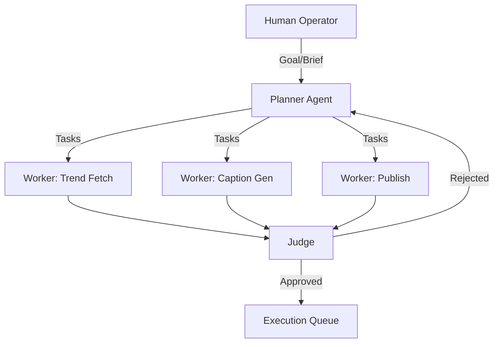
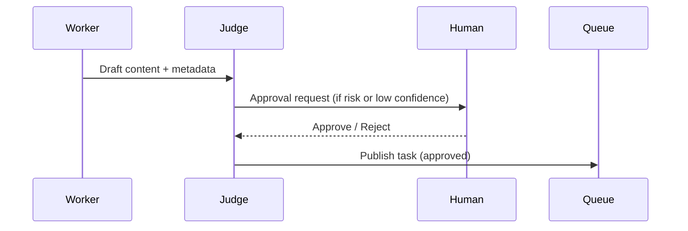
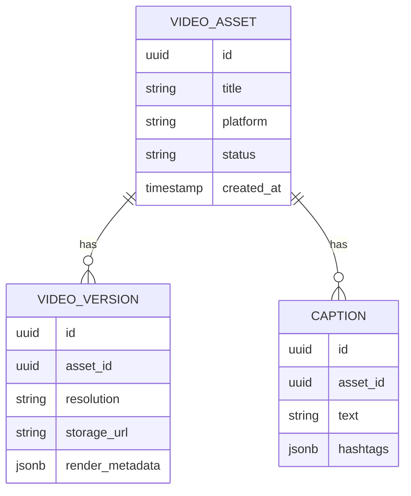

# Architecture Strategy (Task 1.2)

## Purpose
Define the architecture choices for Project Chimera before implementation. This document focuses on agent pattern selection, human approval points, and database strategy for high-velocity video metadata.

## Agent Pattern Selection
**Recommended Pattern:** Hierarchical Swarm (Planner → Worker → Judge)

**Rationale**
- **Planner** decomposes goals (campaigns, calendars, platform mix).
- **Workers** execute specialized skills (trend fetch, captioning, posting).
- **Judge** verifies safety, spec alignment, and budget controls.
- The swarm approach allows parallel task execution with explicit governance.

## Human-in-the-Loop (Safety Layer)
**Approval Points**
- **Content Approval Gate:** Before publishing, the Judge requests approval for:
  - Platform-sensitive content (e.g., regulated or financial topics)
  - Low-confidence outputs
  - High-risk or new personas
- **Budget Approval Gate:** Any financial actions above threshold require CFO Judge + human sign-off.

## Database Strategy for High-Velocity Video Metadata
**Recommendation:** PostgreSQL (SQL) as the primary store, with optional Redis cache.

**Why SQL**
- Strong schema enforcement for metadata integrity.
- Relational joins across campaigns, assets, and agent outputs.
- Supports JSONB for flexible tags and model diagnostics.

**When to Extend with NoSQL**
- High-scale analytics or event logs can be offloaded to a time-series/NoSQL store.
- Weaviate remains the semantic memory layer for agent retrieval.

## Notes
- Aligns with Prime Directives: specs-first, MCP-only integration, agentic design.
- Designed for safe scaling with clear audit trails.
